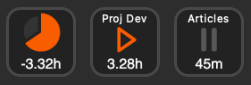

# Harvest Billables for Stream Deck

This [Stream Deck][stream-deck] plugin fetches data from [Harvest][harvest] and [Forecast][forecast]
to let you know how much more billable time you have left for the day.

## Getting Started

**[:arrow_right: Install Plugin in Stream Deck Store][store-page]**

### Generate API Credentials

You'll need to generate an API token in [Harvest][harvest-api] as well
as finding your Harvest Account ID and Forecast Account ID. Both your Harvest and Forecast IDs
can be found under the API token details after [creating it][harvest-api]. These two additional
ids are necessary as they refer to your organization and not your user account.

You only need one API token for all buttons, but you must enter the credentials in every button.

## The Buttons

### Timer

The Timer button is a simple start/stop button and monitor for individual tasks. After entering
your credentials in the settings, a list of available tasks should display in the Task dropdown.
(If it doesn't, try clicking away to another button and clicking back.)

After selecting a task, the button should display a play `⏵` or pause `⏸` button along with the time
tracked for that task for the current day. You can set a Title (looks best if position is "Align
Top") to differentiate Task timers.

### Billables Status

This button will only work if your organization also uses [Forecast][forecast] to track billable
hours. The purpose of this button is to keep you on track for billable hours for the week.

This display will compare your total weekly tracked billable hours to date to your assigned
billable hours in forecast, and display the remaining billable hours you need to fulfill for the
current day.

e.g. If you have 25 assigned hours flagged as billable in Forecast, logged 5 hours on Monday
and 6 hours on Tuesday, and 1 tracked hour on Wednesday (and counting), your display for Wednesday
will show you needing to log another 3 hours (15 hours total) to stay on track for the week, and
the pie chart will be 80% full.

- 25 assigned hours / 5 work days = 5 hours per day
- 5 hours Monday + 6 hours Tuesday = 11 hours, 1 hour ahead of schedule
- 5 hours per day - 1 hour ahead of schedule = 4 remaining hours for Wednesday
- 4 remaining hours - 1 hour tracked = 3 hours remaining for the day
- Display shows: -3h, pie chart 80% full

## Error Messages

Error|Details
---|---
`EAUTH`|Missing harvest token or account ids. [Generate these][harvest-api] and paste them in the settings window.
`ETASK`|No task selected. Make sure tasks are available for your user account, then select a task in the Timer button settings.
`NOPRJ`|No projects found in Forecast. In order for billable hours to display, there must be projects in Forecast that you are assigned to.
`ETIM1`|Error creating time entry.
`ETIM2`|Error restarting time entry.
`ETIM3`|Error stopping time entry.
`H0001`|Error response when fetching data from Harvest.
`H1001`|Error response when posting data to Harvest.
`H2001`|Error response when patching data on Harvest.
`H#403`|Invalid authentication for Harvest. Check token and account id.
`H#404`|Harvest endpoint not found (or invalid authentication). Check token and account id. \*
`H#422`|Error processing Harvest request.
`H#429`|Harvest requests throttled.
`H#500`|Harvest server error.
`H####`|Other Harvest error.
`F0002`|Error response from Forecast.
`F0403`|Invalid authentication for Forecast. Check token and account id.
`F0404`|Forecast endpoint not found (or invalid authentication). Check token and account id. \*
`F0422`|Error processing Forecast request.
`F0429`|Forecast requests throttled.
`F0500`|Forecast server error.
`F####`|Other Forecast error.
`ERROR`|Unhandled error. Details available in DevTools.

\* The API has a bug where if authentication fails, it will sometimes respond
with a `404` instead of a `401`/`403`.

\*\* The second digit in `H#000` and `F#000` errors refers to `GET`, `POST`, or `PATCH` (0, 1, or 2).

## Install Manually

[:arrow_down: Download Latest Release][download-latest]

Unzip and launch the `*.streamDeckPlugin` file and Stream Deck should install the plugin.

To install manually, download the `build-*.zip` file, unzip, and copy the
`me.reinii.harvest-billables.sdPlugin` directory to
`~/Library/Application Support/com.elgato.StreamDeck/Plugins/` on macOS or
`%appdata%\Elgato\StreamDeck\Plugins\` on Windows.

[store-page]: https://apps.elgato.com/plugins/me.reinii.harvest-billables
[download-latest]: https://github.com/reiniiriarios/stream-deck-billables-harvest/releases/latest
[stream-deck]: https://www.elgato.com/en/welcome-to-stream-deck
[harvest]: https://www.getharvest.com/
[forecast]: https://www.getharvest.com/forecast
[harvest-api]: https://id.getharvest.com/developers
